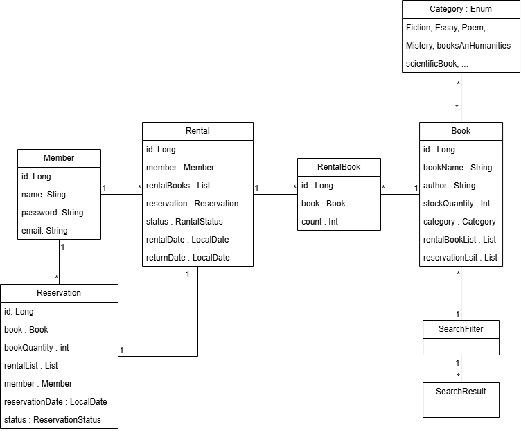

# 도서관리 시스템

---
도서를 예약 및 대여를 할 수 있고, 찾는 도서가 있는지 검색이 가능한 도서관리 시스템

필수 시스템
1. 유저 관리 
    * 로그인/로그아웃
    * 회원가입
    * 회원 탈퇴
    * 회원 정보

2. 도서 관리
    * 도서 등록
    * 도서 수정
    * 도서 삭제
    * 도서 목록 조회
 
3. 대여, 반납
    * 도서 대여
    * 도서 반납
    * 연체 관리

4. 도서 검색
    * 도서 제목/저자/카테고리로 검색
    * 검색 결과 정렬

5. 예약 관리
    * 도서 예약
    * 예약 취소
---
## Domain

---
추가 시스템
1. 알림 기능
2. 도서 추천
3. 회원증 QR인식
4. 비치 희망 도서 신청